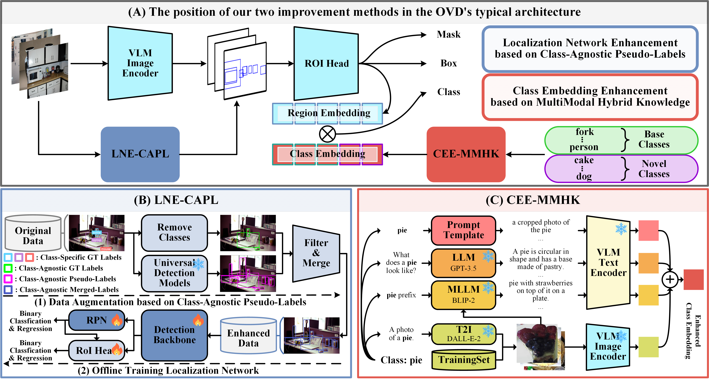

# Boosting Open-Vocabulary Object Detection Performance via Class-Agnostic Pseudo-Labels and MultiModal Hybrid Knowledge

**Note: Our code is developed based on [RegionCLIP](https://github.com/microsoft/RegionCLIP/tree/main).**

## Outline

1. [Installation](#Installation)
2. [Datasets](#Datasets)
3. [Models](#Models)
4. [Method](#Method)
5. [Script](#Script)
6. [Results](#Results)

## Installation

Check [`INSTALL.md`](INSTALL.md) for installation instructions.

## Datasets

Check [`datasets/README.md`](datasets/README.md) for dataset preparation.

## Models

Check [`pretrained_ckpt/README.md`](pretrained_ckpt/README.md) for pretrained model preparation.

## Method

 - **Localization Network Enhancement based on Class-Agnostic Pseudo-Labels (LNE-CAPL)** is used to solve the problem of the localization network having poor generalization ability for novel categories. 

 - **Class Embedding Enhancement based on MultiModal Hybrid Knowledge (CEE-MMHK)** is used to solve the problem that poor class embedding quality affects accuracy.

## Script

All scripts are in the `scripts/` folder.

- `LNE-CAPL.sh`: This script is used to generate class-agnostic pseudo-labels and train the localization network.
- `CEE-MMHK.sh`: This script is used to obtain multimodal class embedding that merges four external knowledge.
- `train_transfer_learning.sh`,`test_transfer_learning.sh`,`test_zeroshot_inference.sh`:  These scripts are used to reproduce the main results of our experiments (transfer learning and zero-shot inference).

## Results

The following two tables show the benchmarks on COCO and LVIS datasets, respectively.

### COCO Benchmark (AP50)

| Method                     | Backbone   | Novel | Base  | All   |
|----------------------------|------------|-------|-------|-------|
| OVR-CNN                    | RN50-C4    | 22.8  | 46.0  | 39.9  |
| ViLD                       | RN50-FPN   | 27.6  | 59.5  | 51.2  |
| Detic                      | RN50-C4    | 27.8  | 51.1  | 45.0  |
| PB-OVD                     | RN50-C4    | 30.8  | 46.1  | 42.1  |
| VL-PLM                     | RN50-FPN   | 32.3  | 54.0  | 48.3  |
| F-VLM                      | RN50-FPN   | 28.0  | -     | 39.6  |
| VLDet                      | RN50-C4    | 32.0  | 50.6  | 45.8  |
| BARON                      | RN50-C4    | 33.1  | 54.8  | 49.1  |
| CORA                       | RN50       | 35.1  | 35.5  | 35.4  |
| RTGen                      | RN50-C4    | 33.6  | 51.7  | 46.9  |
| RegionCLIP                 | RN50-C4    | 31.4  | 57.1  | 50.4  |
| **RegionCLIP + Ours**      | RN50-C4    | **33.8** | 56.9  | **50.9** |
| SAS-Det                    | RN50-C4    | 37.4  | 58.5  | 53.0  |
| **SAS-Det + Ours**         | RN50-C4    | **39.3** | 58.2  | **53.2** |
---

### LVIS Benchmark (AP)

| Method                     | Backbone    | APr | APc | APf | AP    |
|----------------------------|-------------|-----------|-----------|-----------|-------|
| ViLD                       | RN50-FPN    | 16.7      | 26.5      | 34.2      | 27.8  |
| VL-PLM                     | RN50-FPN    | 17.2      | 23.7      | 35.1      | 27.0  |
| DetPro                     | RN50-FPN    | 20.8      | 27.8      | 32.4      | 28.4  |
| F-VLM                      | RN50-FPN    | 18.6      | -         | -         | 24.2  |
| BARON                      | RN50-C4     | 20.1      | 28.4      | 32.2      | 28.4  |
| LBP                        | RN50-FPN    | 22.2      | 28.8      | 32.4      | 29.1  |
| RegionCLIP                 | RN50-C4     | 17.1      | 27.4      | 34.0      | 28.2  |
| **RegionCLIP + Ours**      | RN50-C4     | **21.9**  | 28.6      | 35.5      | **30.2** |
| RegionCLIP                 | RN50x4-C4   | 22.0      | 32.1      | 36.9      | 32.3  |
| **RegionCLIP + Ours**      | RN50x4-C4   | **26.9**  | 33.6      | 39.3      | **34.7** |
| SAS-Det                    | RN50-C4     | 20.9      | 26.1      | 31.6      | 27.4  |
| **SAS-Det + Ours**         | RN50-C4     | **27.1**  | 28.9      | 34.4      | **30.7** |
| SAS-Det                    | RN50x4-C4   | 29.1      | 32.4      | 36.8      | 33.5  |
| **SAS-Det + Ours**         | RN50x4-C4   | **34.6**  | 33.7      | 38.2      | **35.6** |